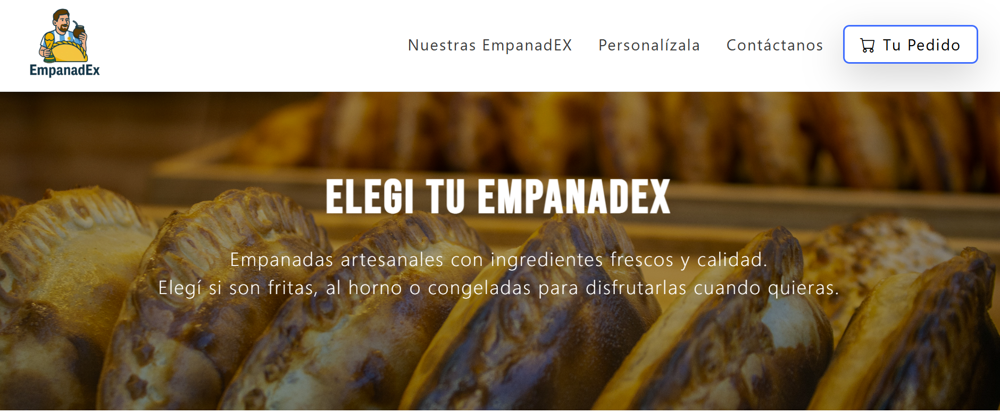

# EmpanadEx

**EmpanadEx** es una página web sin fines de lucro creada como parte del proyecto final del curso **Desarrollo Web Flex** en **CoderHouse**.

El sitio presenta una propuesta visual moderna y atractiva para una tienda de empanadas, destacando productos, variedad y estilo gastronómico.  
Fue desarrollada con el objetivo de aplicar los conocimientos adquiridos en el curso, incluyendo maquetado web, diseño responsivo y buenas prácticas de desarrollo front-end.

## 🌐 Visita el sitio
[https://violetaatkinson.github.io/EmpanadEx/](https://empanad-ex.vercel.app/)

## 🛠️ Tecnologías utilizadas
- **HTML5**
- **CSS3**
- **Bootstrap**
- **SASS**
- **JavaScript**

## ✨ Objetivo del proyecto
Este proyecto tiene fines **educativos y demostrativos**. Su propósito es mostrar el proceso de desarrollo y diseño de una página web completa, integrando diseño visual, estructura semántica y optimización para distintos dispositivos.

## 👩‍💻 Autora
**Violeta Atkinson**  
Proyecto realizado durante el curso **Desarrollo Web Flex - CoderHouse**
